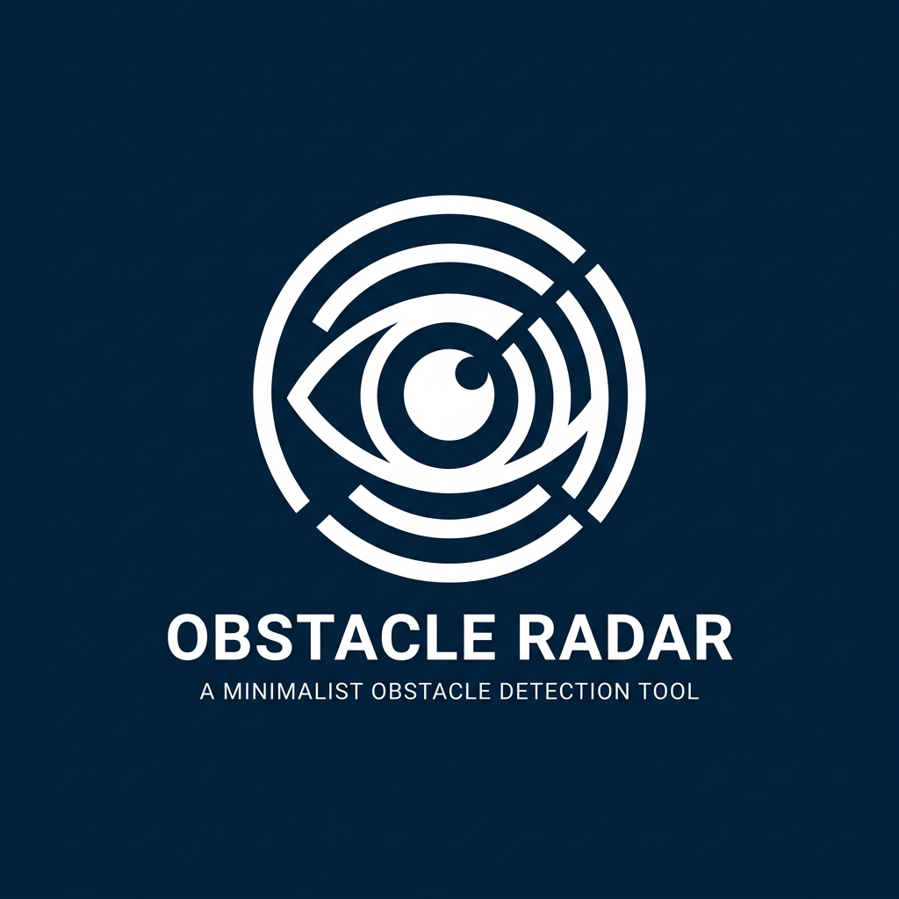
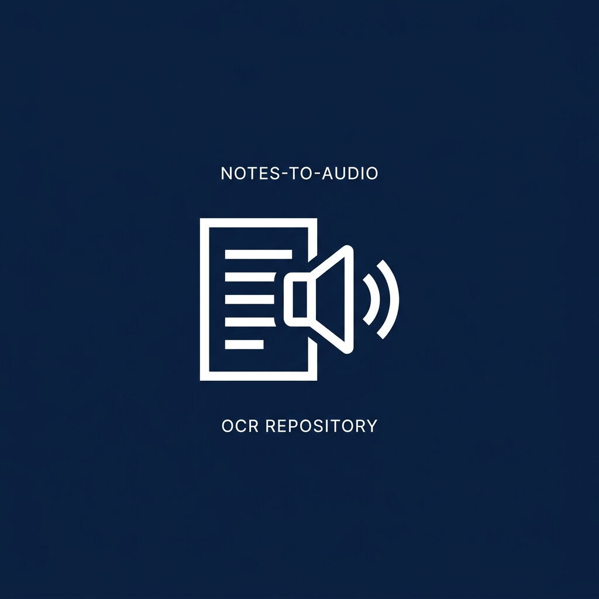
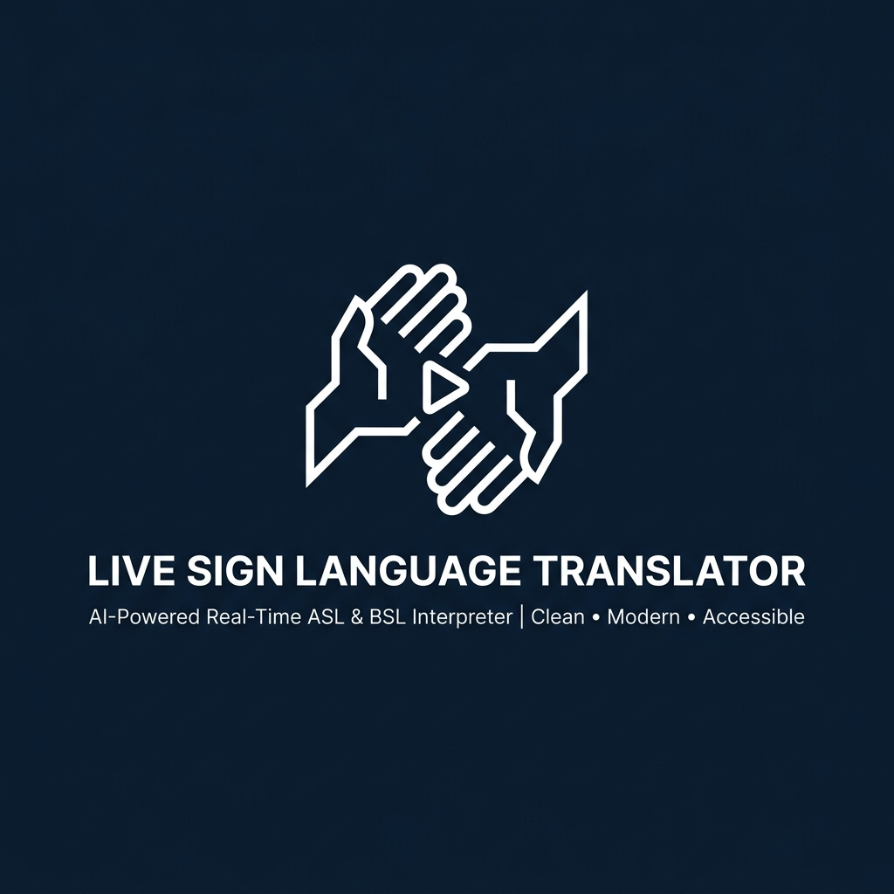
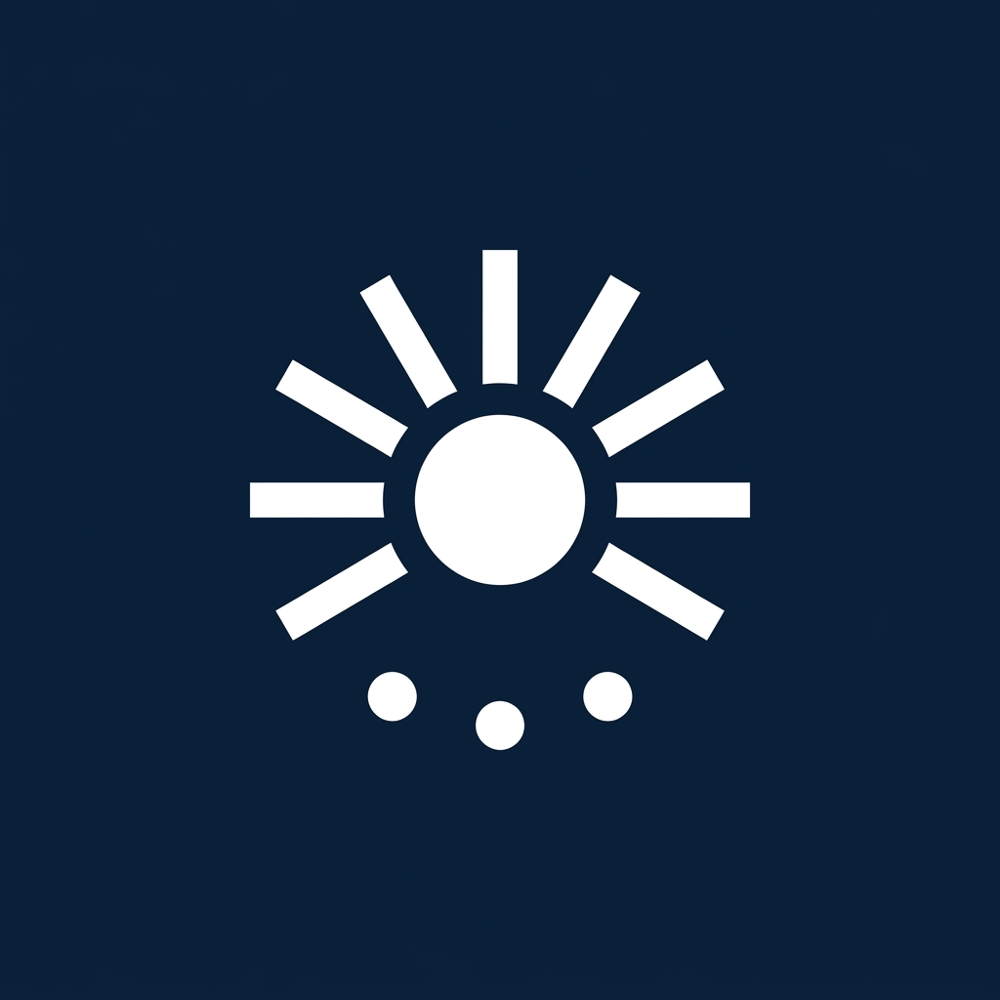

<div align="center">


# AccessApp
### Next-Generation Accessibility Assistant

[](https://kotlinlang.org)
[](https://developer.android.com/)
[](https://developer.android.com/jetpack/compose)
[](https://developers.google.com/mediapipe)

<p align="center">
  <b>AccessApp</b> is an advanced, AI-driven accessibility companion explicitly designed for visually impaired and deaf users navigating complex environments. 
  <br>It integrates state-of-the-art On-Device Machine Learning with fluid, tactile UX.
</p>

</div>

---

<div align="center">
  
</div>

---

## Flagship Modules

<div align="center">
  
  
  
  
</div>

---

## Design Philosophy

AccessApp utilizes a modern, professional aesthetic built for scale and ease of use.
- **Spring-Physics Engine:** Fluid, momentum-based animations powered by Compose's Spring framework.
- **Custom Typography:** Driven entirely by the modern Outfit Google Font.
- **Tactile Soundscapes:** Comprehensive physical button feedback and system audio integration.
- **Adaptive Theming:** Deep Navy Blues and soft gradients that cross-fade seamlessly between Day and Night modes.

---

## Getting Started

### Prerequisites
- Android Studio Iguana (or newer)
- Minimum SDK: **API 30** (Android 11)
- Target SDK: **API 36**

### Build Instructions
1. Clone the repository:
   ```bash
   git clone https://github.com/madd69x/AccessApp.git
   ```
2. Open the project in Android Studio.
3. Allow Gradle to sync and download the required MediaPipe `.tflite` models via the automated Gradle Task.
4. Build and deploy to a physical device (Emulators do not support camera-based features).

---

<div align="center">
  <p><b>Made By Vortex AI</b></p>
  <p>
    Avadhi Sharma (3rd Year CSE) &bull;
    Mudit Vaishnav (2nd Year ECC) &bull;
    Mudra Chauhan (2nd Year CSE) &bull;
    Jigyasha Mahariya (2nd Year ECC) &bull;
    Monalika Vyas (2nd Year P&I)
  </p>
</div>
