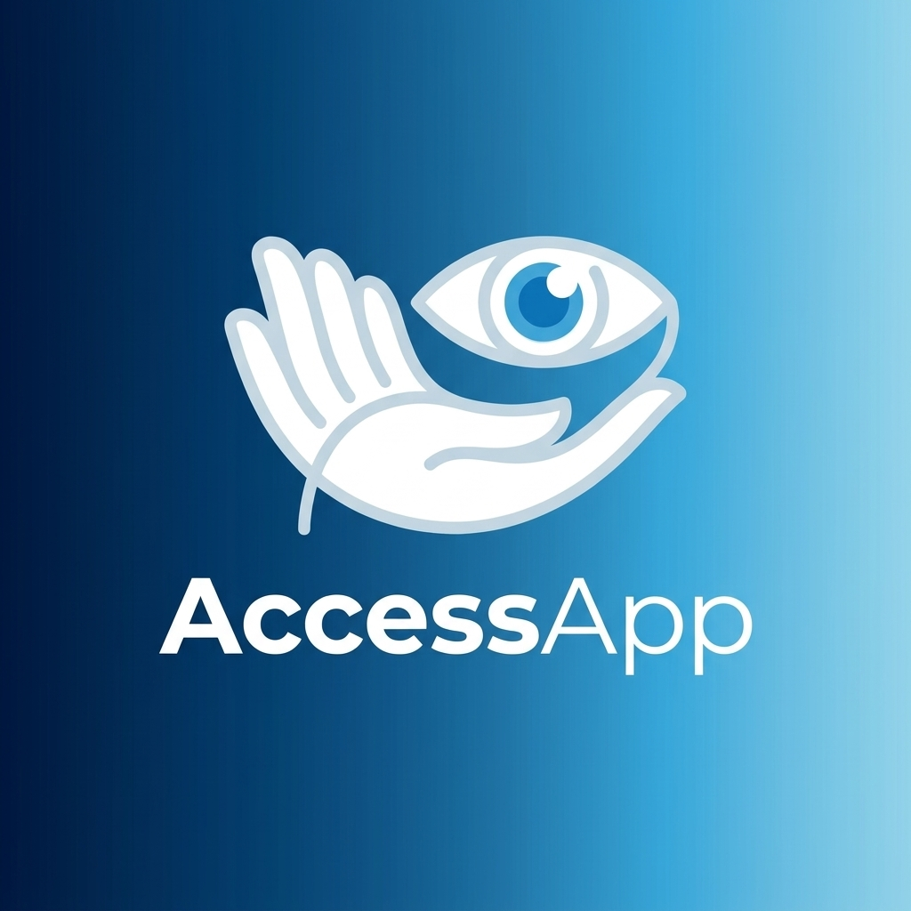
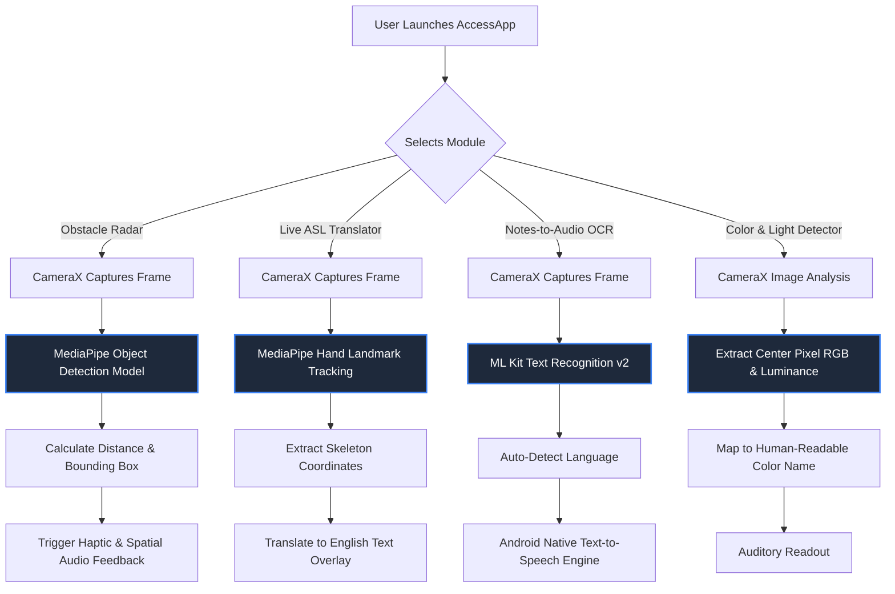
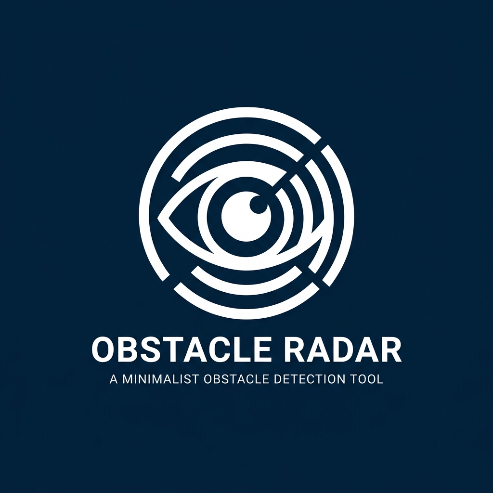
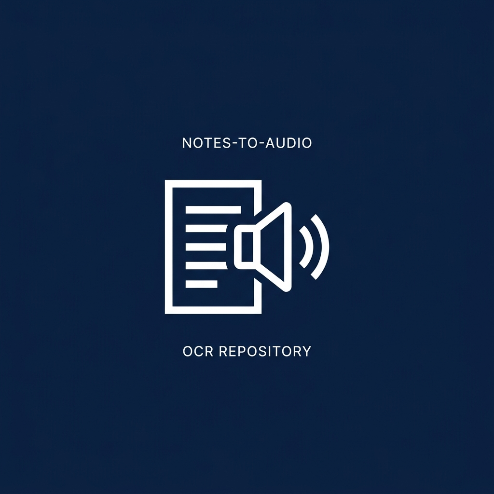
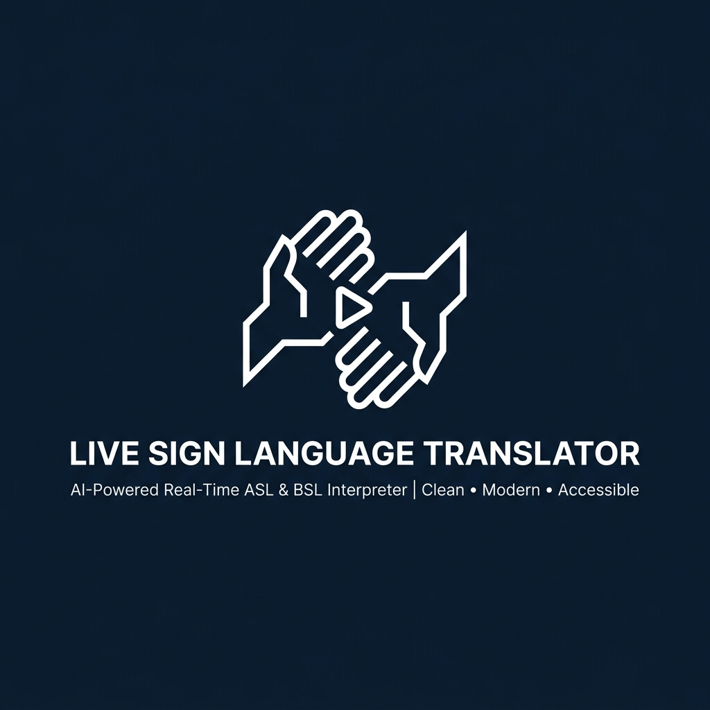

<div align="center">



# AccessApp
### Comprehensive AI-Driven Accessibility Assistant

[](https://kotlinlang.org) [](https://developer.android.com/) [](https://developer.android.com/jetpack/compose) [](https://developers.google.com/mediapipe)

<p align="center">
  <b>AccessApp</b> is a comprehensive, artificial intelligence-driven accessibility application engineered specifically for individuals with visual or auditory impairments. 
  <br>The system leverages edge-based machine learning paradigms to provide real-time spatial awareness without reliance on cloud-based processing.
</p>

</div>

---

<div align="center">
  <h4><a href="DOCUMENTATION.md">View Technical Documentation</a></h4>
  <h2><a href="https://accessapp.vercel.app">Experience the Live Website</a></h2>
  <h2><a href="https://github.com/madd69x/AccessApp/releases">Download the Android App (APK)</a></h2>
</div>

---

## Prototype Workflow Architecture


```mermaid
graph TD
    A[User Launches AccessApp] --> B{Selects Module}
    
    B -->|Obstacle Radar| C[CameraX Captures Frame]
    C --> D[MediaPipe Object Detection Model]
    D --> E[Calculate Distance & Bounding Box]
    E --> F[Trigger Haptic & Spatial Audio Feedback]
    
    B -->|Live ASL Translator| G[CameraX Captures Frame]
    G --> H[MediaPipe Hand Landmark Tracking]
    H --> I[Extract Skeleton Coordinates]
    I --> J[Translate to English Text Overlay]
    
    B -->|Notes-to-Audio OCR| K[CameraX Captures Frame]
    K --> L[ML Kit Text Recognition v2]
    L --> M[Auto-Detect Language]
    M --> N[Android Native Text-to-Speech Engine]
    
    B -->|Color & Light Detector| O[CameraX Image Analysis]
    O --> P[Extract Center Pixel RGB & Luminance]
    P --> Q[Map to Human-Readable Color Name]
    Q --> R[Auditory Readout]
    
    %% Zero Cloud Note
    classDef offline fill:#1e293b,stroke:#3b82f6,stroke-width:2px,color:#fff;
    class D,H,L,P offline;
```

> **Note:** All processing nodes highlighted in blue execute strictly on-device (Zero Cloud architecture), ensuring absolute privacy and zero latency.

---

## ML Model Cards (On-Device Inference)

In accordance with our Zero-Cloud privacy architecture, all machine learning inference is executed locally on the device using quantized models optimized for edge hardware (NPU/CPU/GPU).

### 1. Obstacle Radar: Object Detection Model
*   **Base Architecture:** SSD MobileNet V2 (via Google MediaPipe Vision)
*   **Quantization:** INT8 (Optimized for Android Edge TPUs and mobile CPUs)
*   **Input:** Live `CameraX` video frames (downsampled to 320x320 RGB)
*   **Output:** Bounding boxes, class labels (80 COCO classes), and confidence scores.
*   **Performance Metrics:** Average inference latency of <30ms on Snapdragon 8 Gen 1, enabling fluid 30fps tracking.
*   **Known Limitations:** Depth is approximated via bounding box scale relative to frame size. Extremely low-light environments heavily degrade bounding box confidence.

### 2. Live ASL Translator: Hand Landmark Tracking
*   **Base Architecture:** MediaPipe Handpose (BlazePalm + Landmark Regressor)
*   **Input:** Cropped ROI (Region of Interest) derived from the Palm Detection model.
*   **Output:** 21 3D spatial hand landmarks (x, y, z coordinates).
*   **Performance Metrics:** <15ms inference latency per frame. Hand tracking remains robust under partial occlusions.
*   **Known Limitations:** Requires the user's hand to be within 0.5 - 1.5 meters of the camera. The current translation heuristic focuses on static ASL alphabet letters; complex motion-based ASL signs are in development.

### 3. Notes-to-Audio: Unified OCR
*   **Base Architecture:** Google ML Kit Text Recognition V2
*   **Input:** High-resolution `CameraX` image capture (triggered by user interaction).
*   **Output:** Structured text blocks, lines, and elements with detected languages (Latin & Devanagari).
*   **Performance Metrics:** >95% accuracy on printed text in well-lit conditions.
*   **Known Limitations:** Handwritten text recognition is less accurate. Highly stylized fonts or extremely degraded paper can cause hallucinated characters.

### 4. Color & Light Detector: Computer Vision Heuristic
*   **Base Architecture:** CameraX ImageAnalysis (Algorithmic Processing)
*   **Input:** High-speed `CameraX` video frames (YUV_420_888 format).
*   **Output:** Average RGB values, relative luminance, and nearest human-readable color name.
*   **Performance Metrics:** <5ms inference latency per frame. Extremely lightweight, allowing for continuous background polling without battery drain.
*   **Known Limitations:** Highly sensitive to ambient lighting conditions. Shadows or harsh yellow room lighting can skew the detected color (e.g., mistaking white for yellow).

---

## Flagship Modules

<table>
  <tr>
    <td width="40%" align="center">
      
    </td>
    <td width="60%">
      <h3>Obstacle Radar (MediaPipe Vision)</h3>
      Uses real-time object detection via the device camera to identify approaching obstacles. 
      <br><br>
      <b>Key Features:</b>
      <ul>
        <li><b>Dynamic Haptic Feedback:</b> Device vibrates dynamically based on obstacle proximity.</li>
        <li><b>Sonar Alerts:</b> Emits varying audio tones to indicate distance.</li>
        <li><b>Glassmorphic HUD:</b> Premium UI alerting bystanders and the user to spatial awareness states.</li>
      </ul>
    </td>
  </tr>
  <tr>
    <td width="60%">
      <h3>Notes-to-Audio (Unified OCR)</h3>
      A seamless Optical Character Recognition (OCR) scanner powered by ML Kit.
      <br><br>
      <b>Key Features:</b>
      <ul>
        <li><b>Auto-Language Detection:</b> Automatically detects both Latin (English) and Devanagari (Hindi) characters without manual toggles.</li>
        <li><b>Instant TTS:</b> Instantly converts scanned text into fluid speech using the native Android TTS Engine.</li>
      </ul>
    </td>
    <td width="40%" align="center">
      
    </td>
  </tr>
  <tr>
    <td width="40%" align="center">
      
    </td>
    <td width="60%">
      <h3>Live Sign Language Translator</h3>
      Uses Google's MediaPipe Gesture Recognizer to identify American Sign Language (ASL) letters in real-time. Translates live camera feeds into English text for seamless communication bridging, drastically improving interactivity for deaf users.
    </td>
  </tr>
  <tr>
    <td width="60%">
      <h3>Color & Light Detector</h3>
      Analyzes the center of the camera feed to output exact RGB values, luminance, and human-readable color names (e.g., "Dark Navy Blue") to assist visually impaired users in identifying objects, clothing, and ambient lighting conditions.
    </td>
    <td width="40%" align="center">
      
    </td>
  </tr>

</table>

---

## User Interface and Experience Methodology

The interface is designed strictly in accordance with accessibility best practices, prioritizing tactile feedback and high-contrast visual elements over superfluous aesthetics.
*   **Kinetic Feedback:** Employs the Compose `spring()` physics engine for all interactive elements to provide a sense of physical weight and momentum, aiding spatial memory.
*   **Auditory Cues:** Integrates comprehensive system audio feedback for all state changes and button interactions.
*   **Contrast and Legibility:** Utilizes a carefully calibrated palette of deep navy blues and high-luminance whites, designed for maximal readability.

---

## Getting Started

### Prerequisites
- Android Studio Iguana (or newer)
- Minimum SDK: **API 30** (Android 11)
- Target SDK: **API 36**

### Build Instructions
1. Clone the repository:
   ```bash
   git clone https://github.com/madd69x/AccessApp.git
   ```
2. Open the project in Android Studio.
3. Allow Gradle to sync and download the required MediaPipe `.tflite` models via the automated Gradle Task.
4. Build and deploy to a physical device (Emulators do not support camera-based features).

---

<div align="center">
  <h3>Made By Vortex AI</h3>
  <code>Avadhi Sharma (3rd Year CSE)</code> &bull; <code>Mudit Vaishnav (2nd Year ECC)</code> &bull; <code>Mudra Chauhan (2nd Year CSE)</code> &bull; <code>Jigyasha Mahariya (2nd Year ECC)</code> &bull; <code>Monalika Vyas (2nd Year P&I)</code>
</div>
